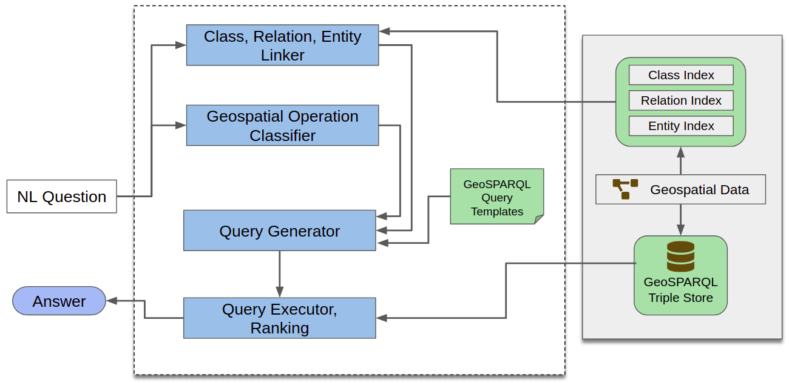

# Geospatial Question Answering over Linked Data

    

## Abstract

Rich geospatial knowledge bases have been made available in recent years. These knowledge bases capture geometries beyond simple point based (lat-long pairs) geometries that can capture complex geographical areas such as city/state boundaries, entire streets, rivers, etc. This thesis presents an approach for answering geospatial questions using geospatial knowledge stored as linked data. The system uses GeoSPARQL queries, which is a standard for representation and querying of geospatial data. The goal of this system is to translate natural language geospatial questions into corresponding GeoSPARQL queries. The system also supports question with aggregates (e.g., how many), comparisons (e.g., height more than 50 m), and superlatives (e.g., highest mountain). The query generation task is tackled using a modular approach which gives more control and flexibility in implementation. Evaluations show promising results with room for improvement. The ablation study carried out as part of the evaluation assesses each module's influence on the overall system.

Falcon 2.0 adapted for LinkedGeoData: https://github.com/tohardik/falcon2.0
Geo-clasifier: https://github.com/tohardik/geo-classifier
